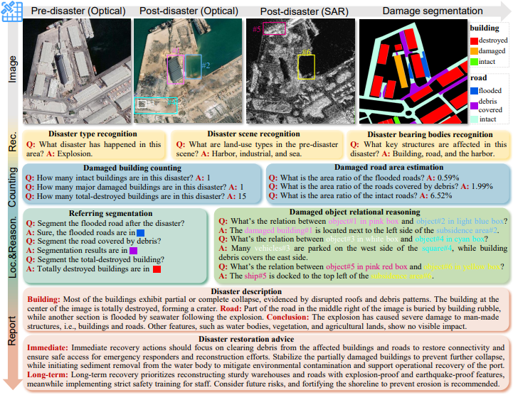

# DisasterM3 paper summary

## problem statement,
- Now, VLMs are capable these days when it comes to Earth vision, but complex disaster scenes with diverse disaster types, geographic regions, and satellite sensors have posed new challenges for VLM applications.

## Solution
- According to the paper, it's a remote sensing vision-language dataset 
for global-scale disaster assessment and response. There are other remote sensing datasets, what distinguishes this dataset is that it's  Multi-hazard,  Multi-sensor and Multi-task. 
- So hopefuly, this dataset will enable finetuning VLMs more capable to handle complex disaster scenes with diverse disaster types, geographic regions, and satellite sensors which by the way have posed new challenges for VLM applications, Als evluating these models on these cases. 

## A brief glimpse of the experimentation that was conducted 
- SO in this experimentation, 18 VLM models and they have been evaluated on several Perception and Reasoning Tasks in the Context of Disaster, and they are Disaster Recognition, Damage Assessment , Disaster Referring Segmentation , Damaged Object Relational Reasoning , Disaster Comprehensive Report. The following image covers all supported tasks: 

- And in the metrics used in evaluation were  accuracy (%) for the multiplechoice tasks, i.e., disaster scene recognition (DSR) The open-ended tasks are scored using GPT-4.1 at a scale of 5 points. Disaster caption is measured from damage assessment precision (DAP), damage detail recall (DDR),and factual correctness (FC). Restoration advice is measured from recovery necessity (RN), strategic completeness (SC), and action priority precision (APP). As for referring segmentation,we chose cIoU and mIoU.

- Like any project or research, it has its own limitation, and in our case, we have few limitations like the lack of Multi-resolution generalization, Enhanced sensor diversity , Cross-sensor performance gap and Counting task optimization.

