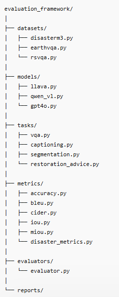

# Analysis:
- So we have models and pyscripts that have code inside them, models folder is for AI models-related code, it has code that import the model using transformers and do some processing over images. 
- the pyscripts folder has different scripts for creating the prompt template, mapping data into messages AI models can understand, creating batches for efficiency.
- There is actually two python files that have code inside only, one for data loading in general, and the other for model inference.
- **Limitation**, the eval section is completely missing, and the codebase might need a lot of refactoring. I am not expert in software design but it looks very far from being modular. 
- There is plenty of evaluation and benchmarking that we can get inspiration from like **[VLMEvalKit](https://github.com/open-compass/VLMEvalKit)** for evaluating VLMs, but Chatgbt suggested an architecture I loved: 
