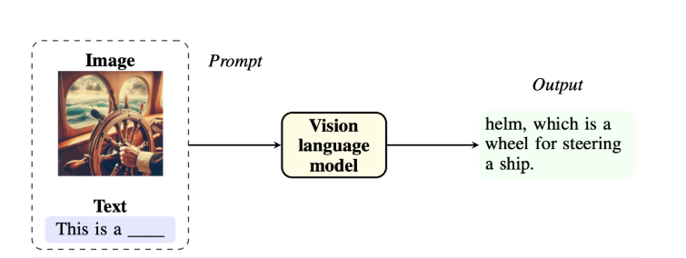

# Evaluation methodology: 

Also, in this section I will use the topic of natural disasters to explain evaluation metrics, and use the terminology and use cases presented in the in DisasterM3 paper. 

Now, the nature of datasets used to evaluate VLM model are made of pairs of images and texts, because it takes typically an image and a question about this image. Here is an example of how VLM are used : 

Figure 1

You can see this clearly in [EarthVLSet](https://huggingface.co/datasets/Kingdrone-Junjue/EarthVLSet), where there are folders to store images and json file for text "questions".

So in computer vision we have Classification, detection and segmentation, and each has its own metrics: 

## Classification metrics: 
Accuracy, it's the most common metric.
	Accuracy=TotalPredictions/CorrectPredictions​ 
And this metric used in the DisasterM3 paper to evaluate multiple choice tasks, i.e., disaster scene recognition (DSR), disaster type recognition (DTR), bearing body recognition (BBR), damaged building counting (DBC), damaged road estimation (DRE), object relational reasoning (ORR).
There is other metrics that could be used to evaluate classification, like Precision, Recall and F1 Score. 3
Precision and recall are also important metrics, especially in tasks involving retrieval or detection. Precision measures the proportion of relevant instances among the retrieved instances, while recall calculates the proportion of relevant instances that have been retrieved over the total amount of relevant instances. These metrics are particularly useful in scenarios like image retrieval, where the goal is to fetch images that accurately reflect the search query.2

F1 score, the harmonic mean of precision and recall, combines these two metrics to provide a single score that reflects the balance between precision and recall. This is valuable in evaluating models where both false positives and false negatives carry significant costs.2

## LLM or VLM as Judge:
I mentioned this next, because it's the next metric or method used in the DisasterM3 paper, and it's become very popular recently. 

In the paper for example, The open-ended tasks are scored using GPT-4.1 at a scale of 5 points. Disaster caption is measured from damage assessment precision (DAP), damage detail recall (DDR), and factual correctness (FC).3

## Segmentation metrics: 
###  Intersection over Union (IoU)
 it is a common metric for evaluating image segmentation models. It measures the overlap between the predicted segmentation and the ground truth.
### Dice Coefficient
measures the similarity between two sets of data. It is particularly effective in assessing the accuracy of image segmentation models.

## Captioning Metrics

In tasks involving image captioning, metrics such as BLEU, METEOR, and CIDEr are frequently used. BLEU (Bilingual Evaluation Understudy) measures how many words in the generated captions are also found in the reference captions, emphasizing precision. METEOR (Metric for Evaluation of Translation with Explicit ORdering) considers precision and recall while also accounting for synonyms and stemming, offering a more nuanced evaluation of linguistic quality.2

## References 
1. CRFM Stanford, https://crfm.stanford.edu/helm/vhelm/latest/
2. https://milvus.io/ai-quick-reference/what-are-the-key-metrics-used-to-evaluate-visionlanguage-models
3. DisasterM3 paper 

